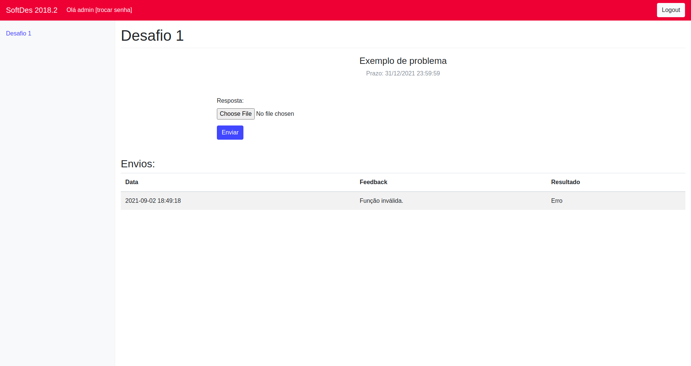

# Softdes-Desafios

## Descrição do projeto:

Softdes-Desafios é um framework de correção automática 
de desafios de programação que já foi usado na matéria de 
design de software do Insper. 
Atualmente não está rodando em nenhum lugar e está desatualizado.

## Screenshot:

## Links para docs:
https://sabrinamb.github.io/softdes-desafios/